# <� Internet of Emotions - Class Diagrams (Mermaid)

## =� Table of Contents
1. [System Architecture Overview](#system-architecture-overview)
2. [Main Class Diagram](#main-class-diagram)
3. [ML/AI Pipeline Classes](#mlai-pipeline-classes)
4. [Data Management Classes](#data-management-classes)
5. [Intelligence & Optimization Classes](#intelligence--optimization-classes)
6. [Database Schema](#database-schema)
7. [Design Patterns](#design-patterns)
8. [Class Relationships](#class-relationships)

---

## <� System Architecture Overview
[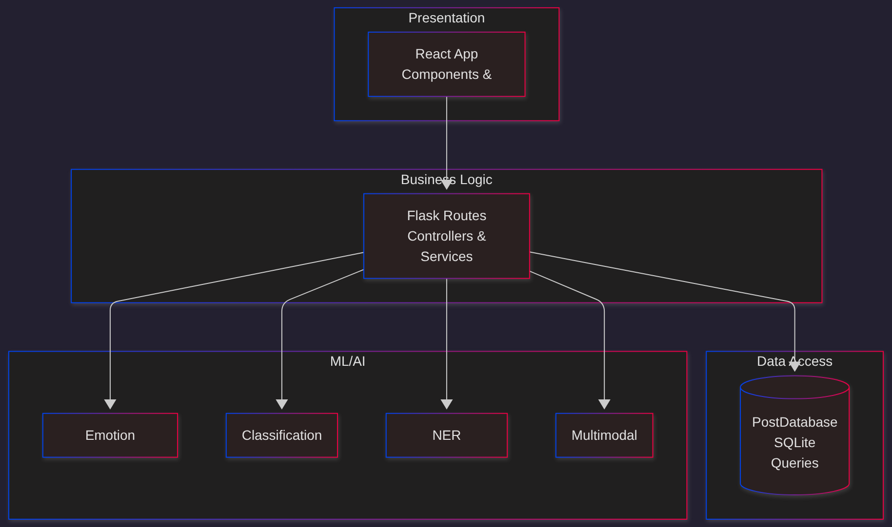](Images/Class_Diagrams/SystemArchitectureOverview.png)

## <� Main Class Diagram

## >� ML/AI Pipeline Classes

## =� Data Management Classes

## � Intelligence & Optimization Classes

## =� Database Schema
[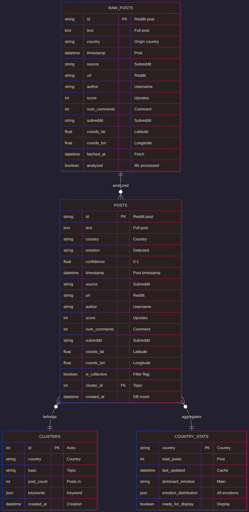](Images/Class_Diagrams/DatabaseSchema.png)

### Database Indexes
[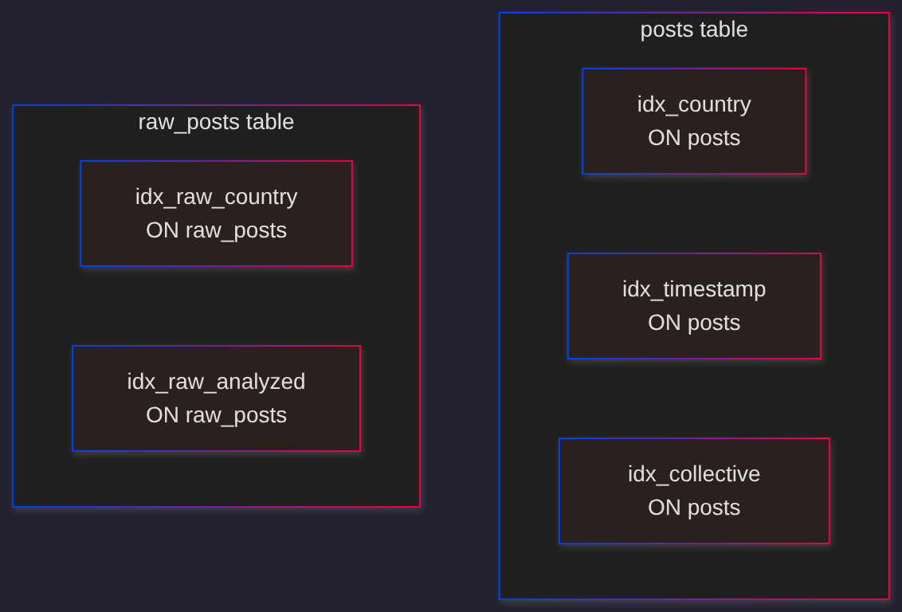](Images/Class_Diagrams/DatabaseIndexes.png)

## <� Design Patterns
[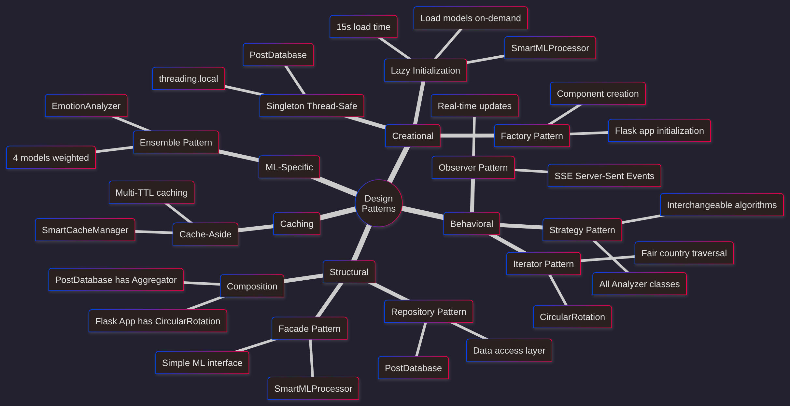](Images/Class_Diagrams/DesignPatterns.png)

### Pattern Details
[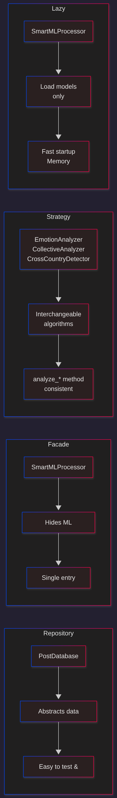](Images/Class_Diagrams/PatternDetails.png)

## = Class Relationships

### Complete Dependency Graph
[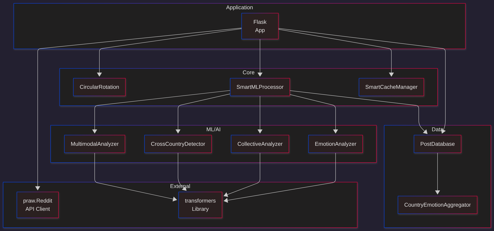](Images/Class_Diagrams/CompleteDependencyGraph.png)

### Relationship Types
[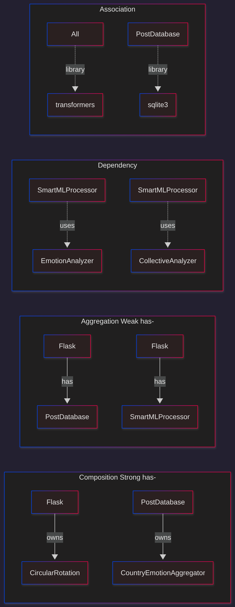](Images/Class_Diagrams/RelationshipTypes.png)

## = Data Flow Through Classes
[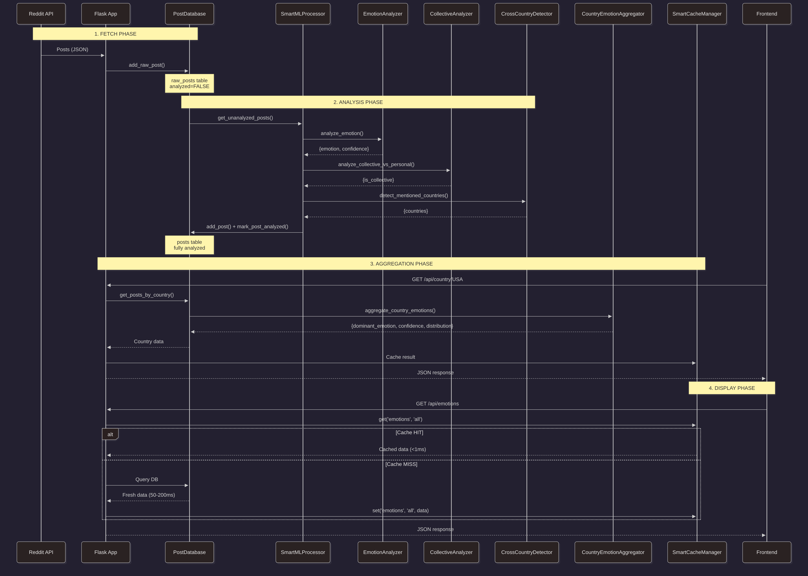](Images/Class_Diagrams/DataFlowThroughClasses.png)

## <� Object Lifecycle
[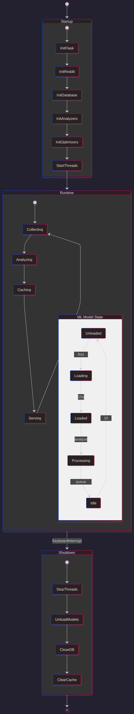](Images/Class_Diagrams/ObjectLifecycle.png)

### Startup Sequence
[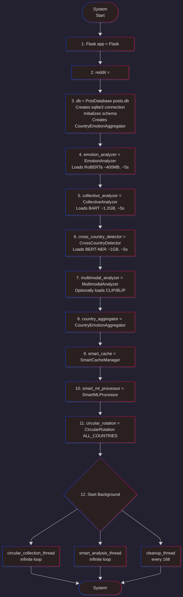](Images/Class_Diagrams/StartupSequence.png)

## = Thread Safety

## =� Class Metrics

## =� External Dependencies

## <� Architecture Benefits
[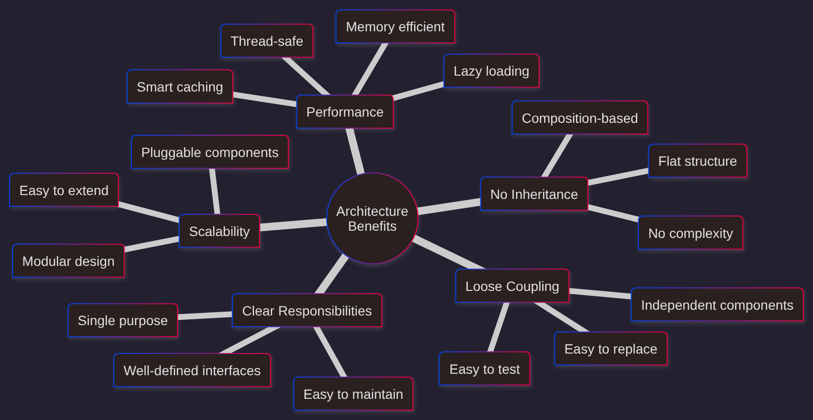](Images/Class_Diagrams/ArchitectureBenefits.png)

## =� File References

- **Backend:** [app.py](app.py), [smart_scheduler.py](smart_scheduler.py), [post_database.py](post_database.py)
- **ML Analyzers:** [emotion_analyzer.py](emotion_analyzer.py), [collective_analyzer.py](collective_analyzer.py), [cross_country_detector.py](cross_country_detector.py), [multimodal_analyzer.py](multimodal_analyzer.py)
- **Aggregation:** [country_emotion_aggregator.py](country_emotion_aggregator.py)

