# 🎭 Internet of Emotions - Use Case Diagrams (Mermaid)

## 📋 Table of Contents
1. [Main Use Case Diagram](#main-use-case-diagram)
2. [Actor Overview](#actor-overview)
3. [End User Use Cases](#end-user-use-cases)
4. [Backend & Reddit API Use Cases](#backend--reddit-api-use-cases)
5. [ML Pipeline Use Cases](#ml-pipeline-use-cases)
6. [Scheduler Use Cases](#scheduler-use-cases)
7. [Database Use Cases](#database-use-cases)
8. [Use Case Relationships](#use-case-relationships)

---

## 🎯 Main Use Case Diagram
[

## 👥 Actor Overview
[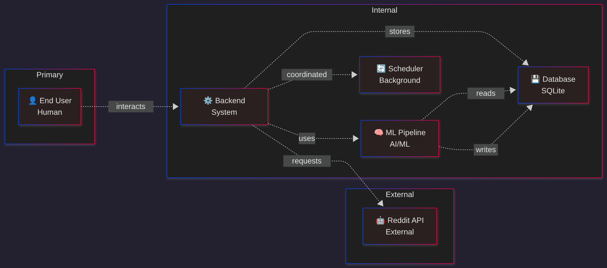](Images/UseCase_Diagrams/ActorOverview.png)

## 👤 End User Use Cases
[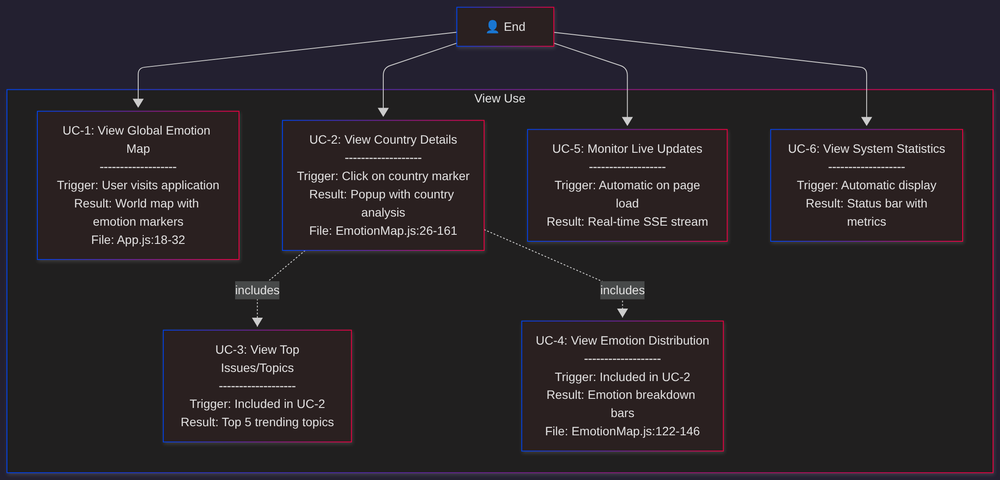](Images/UseCase_Diagrams/EndUserUseCases.png)

## 🤖 Backend & Reddit API Use Cases
[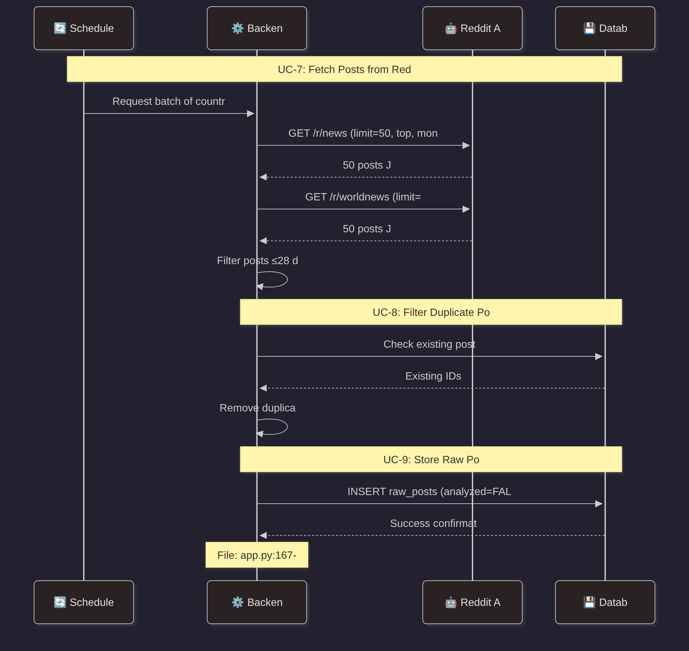](Images/UseCase_Diagrams/Backend&RedditAPIUseCases1.png)

[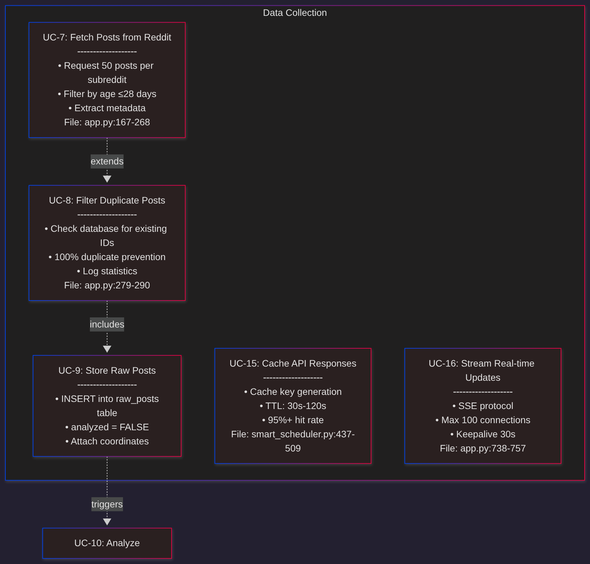](Images/UseCase_Diagrams/Backend&RedditAPIUseCases2.png)

## 🧠 ML Pipeline Use Cases
[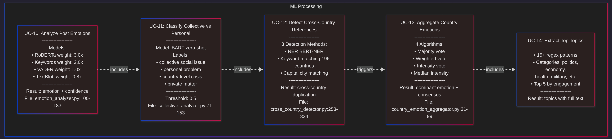](Images/UseCase_Diagrams/ML-PipelineUseCases1.png)

[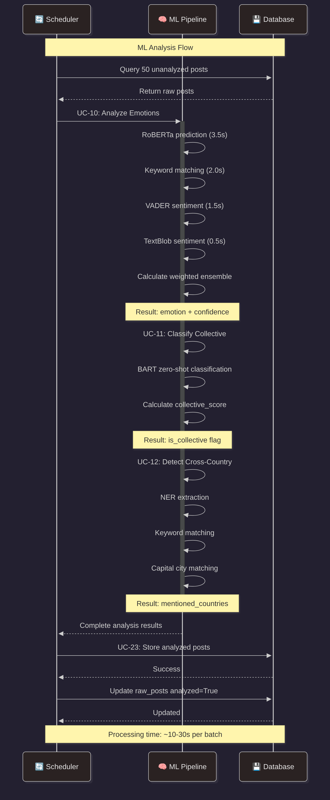](Images/UseCase_Diagrams/ML-PipelineUseCases2.png)

## 🔄 Scheduler Use Cases
[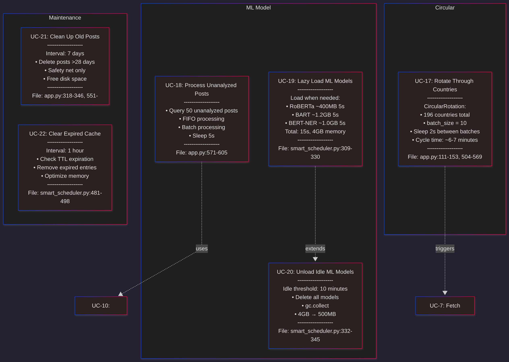](Images/UseCase_Diagrams/SchedulerUseCases1.png)

[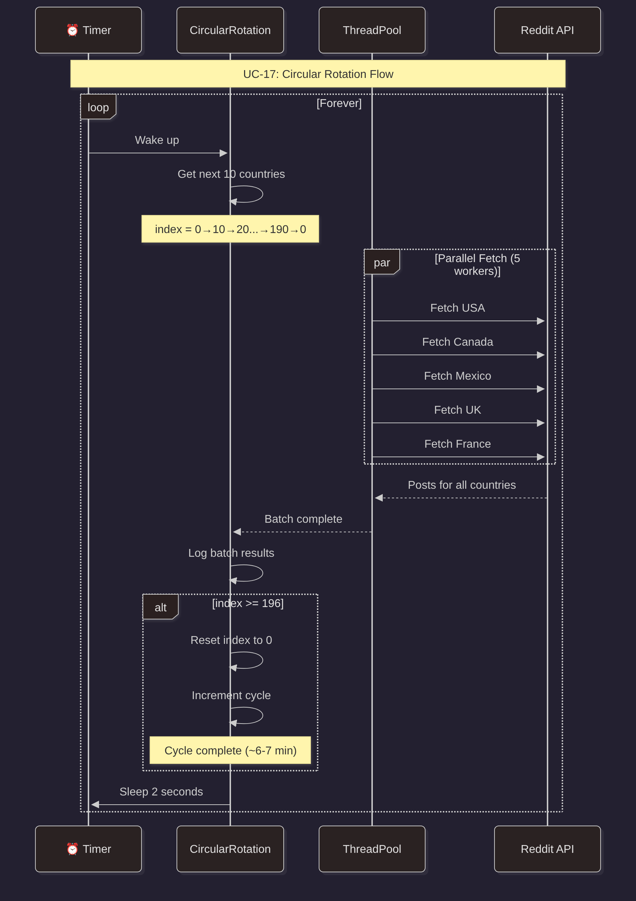](Images/UseCase_Diagrams/SchedulerUseCases2.png)

## 💾 Database Use Cases
[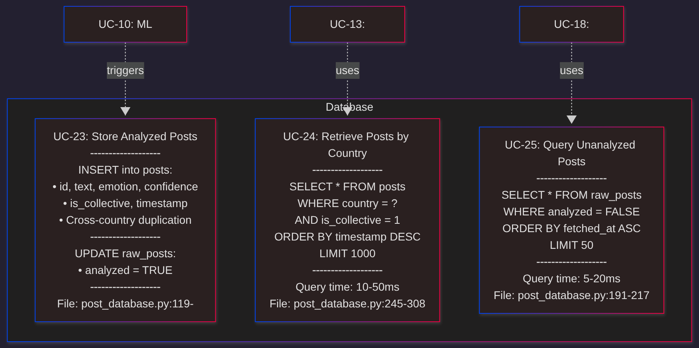](Images/UseCase_Diagrams/DatabaseUseCases1.png)

[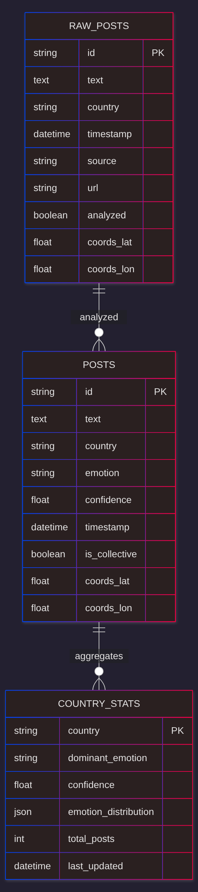](Images/UseCase_Diagrams/DatabaseUseCases2.png)

## 🔗 Use Case Relationships
[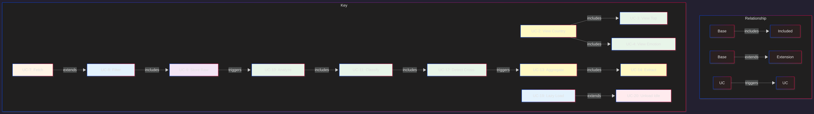](Images/UseCase_Diagrams/UseCaseRelationships.png)

## 📈 Use Case Priority Matrix
[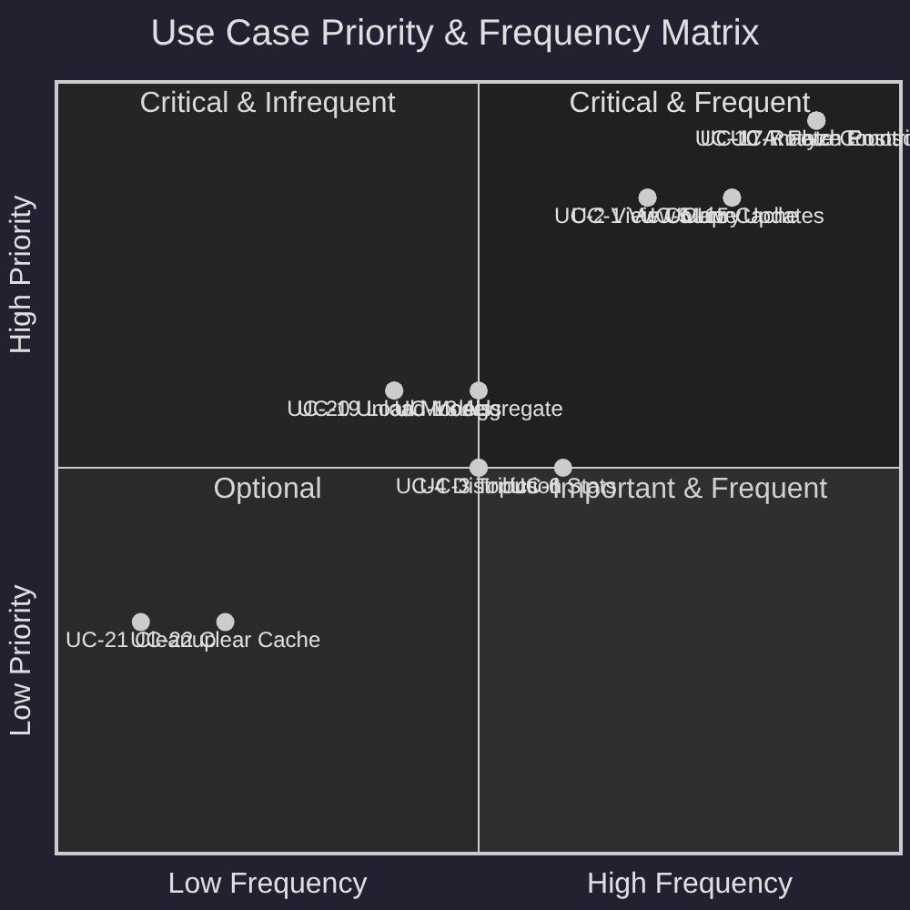](Images/UseCase_Diagrams/UseCasePriorityMatrix.png)

## 🎬 Complete System Flow
[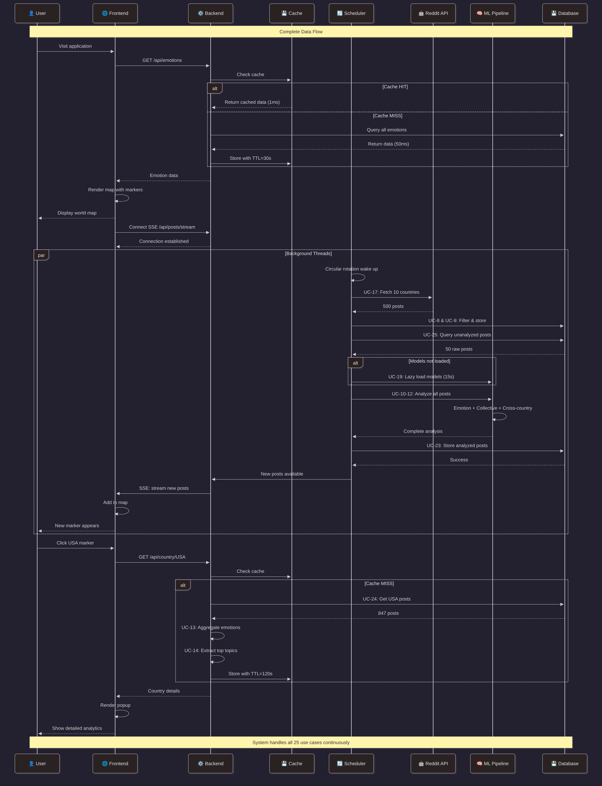](Images/UseCase_Diagrams/CompleteSystemFlow.png)

## 📊 Summary Statistics

| Category | Count | Priority Distribution |
|----------|-------|----------------------|
| **Total Use Cases** | 25 | Critical: 6, High: 4, Medium: 11, Low: 4 |
| **End User** | 6 | 100% user-facing |
| **Backend & Reddit** | 10 | Data pipeline core |
| **ML Pipeline** | 5 | AI/ML processing |
| **Scheduler** | 6 | Automation & optimization |
| **Database** | 3 | Persistence layer |

### Performance Metrics
- **Cycle time**: ~6-7 minutes (all 196 countries)
- **ML processing**: 10-30s per batch (50 posts)
- **Cache hit rate**: >95%
- **API response**: <100ms (cached), <500ms (uncached)
- **SSE latency**: <100ms
